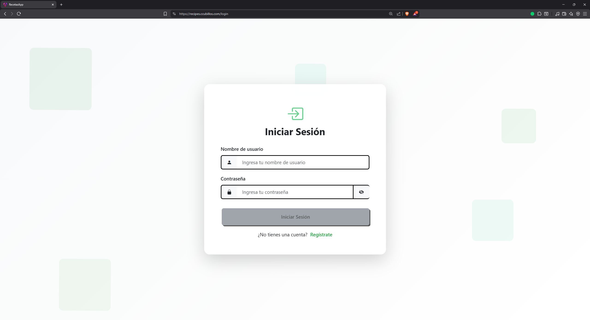
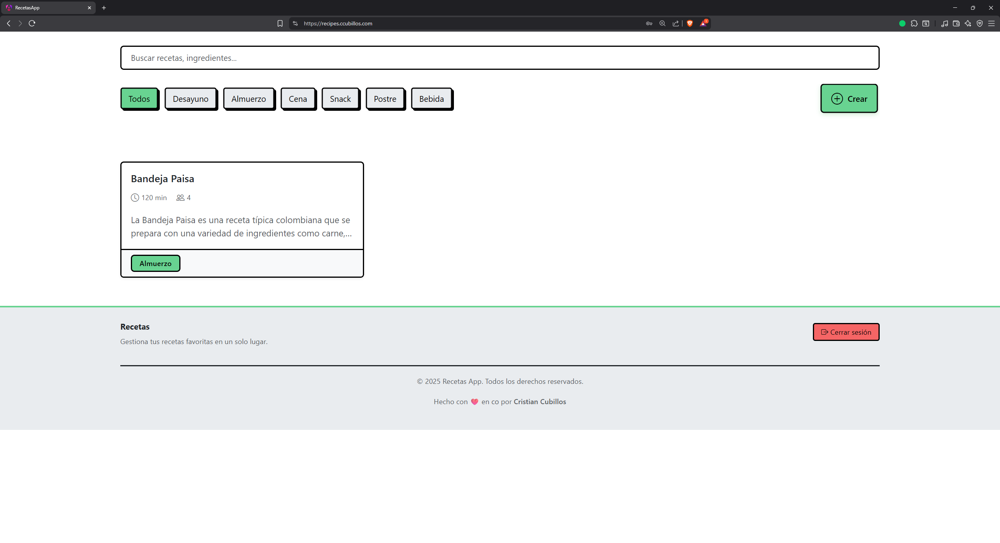
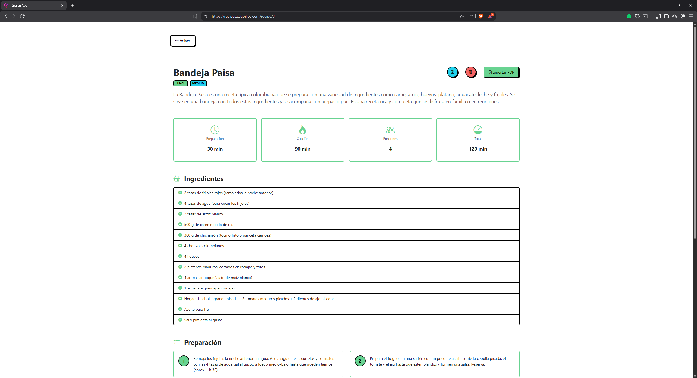

# Recetas App - Gestión de Recetas de Cocina

Aplicación web full-stack para la gestión de recetas de cocina con sistema de autenticación y funcionalidad de exportación a PDF.

## 📑 Tabla de Contenidos

- [🌐 Demo en Vivo](#-demo-en-vivo)
- [📸 Capturas de Pantalla](#-capturas-de-pantalla)
- [📋 Descripción](#-descripción)
- [🛠️ Tecnologías](#️-tecnologías)
- [📦 Instalación](#-instalación)
- [🚀 Uso](#-uso)
- [👥 Contribuciones](#-contribuciones)

## 🌐 Demo en Vivo

Puedes probar la aplicación en funcionamiento sin necesidad de instalarla:

**[https://recipes.ccubillos.com/](https://recipes.ccubillos.com/)**

## 📸 Capturas de Pantalla

<div align="center">

### Inicio de Sesión


### Lista de Recetas


### Detalle de Receta


</div>

## 📋 Descripción

Esta aplicación permite a los usuarios gestionar sus recetas de cocina de manera sencilla y organizada. Incluye las siguientes características:

- **Sistema de autenticación**: Registro e inicio de sesión con JWT
- **Gestión de recetas**: Crear, editar, visualizar y eliminar recetas
- **Exportación a PDF**: Genera documentos PDF con el detalle completo de las recetas
- **Interfaz moderna**: Diseño responsivo y amigable construido con Angular

### Funcionalidades principales

- **CRUD de recetas**: Crear, leer, actualizar y eliminar recetas
- **Filtrado y búsqueda rápida de recetas**: Encuentra tus recetas fácilmente
- **Exportación a PDF de recetas**: Descarga tus recetas en formato PDF

## 🛠️ Tecnologías

### Backend
- **Spring Boot 3.4.11** (Java 17)
- **Spring Security** con JWT
- **Spring Data JPA**
- **MySQL 8.0**
- **OpenHTMLtoPDF y Thymeleaf** para generación de PDF

### Frontend
- **Angular 20.3**
- **Bootstrap** (Bootswatch)
- **Bootstrap Icons**

### Infraestructura
- **Docker** y **Docker Compose**
- **Nginx** para servir el frontend

## 📦 Instalación

### Prerrequisitos

- Docker y Docker Compose instalados
- Git

### Pasos de instalación

1. **Clonar el repositorio**

```bash
git clone <url-del-repositorio>
cd recetas-app-spring-angular
```

2. **Configurar las variables de entorno**

Crear un archivo `.env` en la raíz del proyecto con las siguientes variables:

```env
# Clave secreta para JWT (generar una cadena aleatoria segura)
JWT_SECRET_KEY=tu_clave_secreta_jwt_aqui

# Entorno de producción
IS_PRODUCTION=true

# URL del frontend - IMPORTANTE para configuración CORS
# Esta variable define el origen permitido por las configuraciones CORS del backend
# Debe coincidir con la URL desde donde se accederá al frontend
FRONTEND_URL=http://localhost
```

**Nota importante sobre `FRONTEND_URL`**: Esta variable es crucial para el correcto funcionamiento de la aplicación, ya que el backend utiliza este valor para configurar las políticas CORS (Cross-Origin Resource Sharing). Asegúrate de que coincida exactamente con la URL desde donde accederás a la aplicación.

3. **Levantar los contenedores**

```bash
docker compose up --build
```

Este comando iniciará tres servicios:
- Base de datos MySQL
- Backend Spring Boot
- Frontend Angular con Nginx

4. **Acceder a la aplicación**

Una vez que los contenedores estén en ejecución, la aplicación estará disponible en:

```
http://localhost:80
```

## 🚀 Uso

### Primera vez

1. Accede a `http://localhost:80`
2. Regístrate creando una nueva cuenta
3. Inicia sesión con tus credenciales
4. Comienza a crear y gestionar tus recetas

## 📝 Licencia

Este proyecto está bajo la Licencia MIT. Consulta el archivo [LICENSE](LICENSE) para más detalles.

## 👥 Contribuciones

Las contribuciones son bienvenidas. Por favor, abre un issue o pull request para sugerencias o mejoras.

